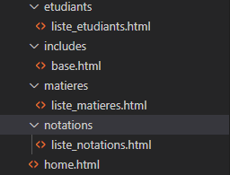
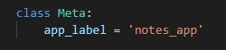

##__I. Création du projet :__

 Avant de commencer, lancez une application qui vous permettra d'insérer du code. Pour ma part, il s'agit de Visual Studio Code.

Les commandes à lancer dans un premier temps :

 Créer une nouvelle application

python manage.py startapp notes_app

 Aller dans le répertoire de l'application

cd notes_app

II. Déploiement des classes :

 Après cela, nous allons lancer la commande "python manage.py startapp notes_app" qui permettra dans notre dossier de créer une application. Avec cette commande, plusieurs fichiers .py ont été créés, et nous allons nous concentrer sur celui se situant dans notes_app > models.py. Ici, nous allons importer les trois classes qui sont "matières", "étudiants" ainsi que "notations".

 Pour terminer ce deuxième chapitre, nous allons effectuer l'application des migrations avec les commandes suivantes :

python manage.py makemigrations
python manage.py migrate

III. Création des formulaires :

 Nous allons créer un formulaire que nous nommerons forms.py dans notes_app, ce qui permettra d'importer les variables Matières, Étudiant et la notation. Par la suite, dans notes_app > Views.py, nous allons alimenter ce fichier afin de traiter les requêtes des trois classes définies avant.

IV. Alimentation du fichier views.py

c'est l'endroit où vous devriez définir les fonctions de vue qui seront responsables de traiter les requêtes HTTP 

V. Creation des Templates HTML 

 Nous allons creer des templates HTML dans un dossier que nous nommerons "Templates", avec les commandes suivantes :
 Créez un dossier templates dans le répertoire de votre application notes_app :

cd notes_app
mkdir templates

 Cela créera un dossier templates à l'intérieur de votre application Django.

Structure des Templates :

 Créez un sous-dossier pour chaque modèle principal (matières, étudiants, notations).

cd templates
mkdir matieres
mkdir etudiants
mkdir notations

 Créez également un dossier includes pour stocker les éléments réutilisables, tels que l'en-tête et le pied de page. (Il s'agirra de notre base)

mkdir includes

 Apres ça nous allons ajouter des fichier .html que nous allons allimenter apres ça il nous faudras configurer le fichier views.py afin de pouvoir utiliser ses templates.

VI. Ajout des URL 

VII. Ajout des Urls dans les fichiers concernés

Pour finir nous devons mettre en place les urls afin quils soient importer sur le site.

VIII. Tester l'applications 

Avec la commande python manage.py runserver l'application est sensé demarrer. 

!Erreur rencontré, j'ai du ajouter des lignes dans mon models.py pour que chaque variable "Matiere" "Etudiant" "Notation"  :

